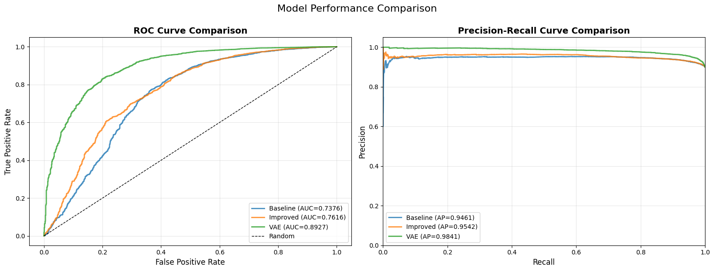
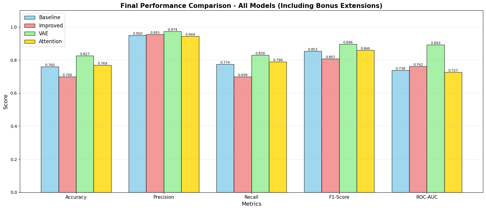
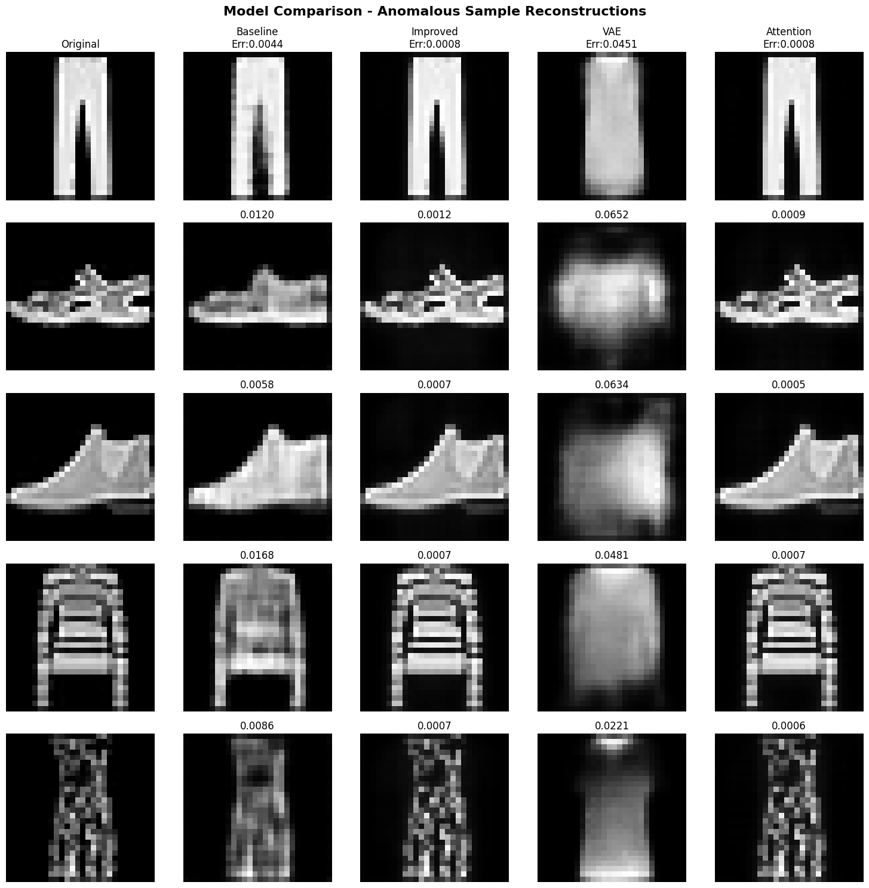

# Convolutional Autoencoder for Image Anomaly Detection

An unsupervised image anomaly-detection project built with convolutional autoencoders on **Fashion-MNIST**.  
The project compares four architectures — a baseline convolutional autoencoder, an improved CAE with skip connections, a variational autoencoder (VAE), and an attention-enhanced CAE — using reconstruction error as the anomaly score.


## Overview

Anomaly detection aims to identify samples that deviate from normal patterns. This project follows a **one-class learning** setup: the models are trained only on normal samples, then reconstruction error is used to distinguish normal images from anomalies.

For the experiments, **T-shirt/top** images are treated as the normal class, while all other Fashion-MNIST categories are treated as anomalies.

## Dataset

**Fashion-MNIST** contains 70,000 grayscale images across 10 clothing categories, with each image sized **28×28 pixels**.

Project split:

- **Training:** 4,800 normal T-shirt/top images
- **Validation:** 1,200 normal T-shirt/top images
- **Test:** 10,000 images
  - 1,000 normal samples
  - 9,000 anomalous samples

Images are normalized to **[0, 1]** and reshaped to **28×28×1** for convolutional processing.

## Models

### 1. Baseline Convolutional Autoencoder
A standard encoder-decoder architecture trained to reconstruct normal Fashion-MNIST images.

### 2. Improved Convolutional Autoencoder
An enhanced CAE using:
- Batch normalization
- Dropout
- Skip connections
- Deeper convolutional feature extraction

### 3. Variational Autoencoder (VAE)
A probabilistic autoencoder with:
- Latent mean and variance
- Reparameterization trick
- Reconstruction loss
- KL-divergence regularization

### 4. Attention-Enhanced CAE
A convolutional autoencoder extended with a self-attention mechanism to model broader feature relationships.

## Anomaly Detection Method

Each model is trained only on normal samples. At test time:

1. The input image is reconstructed.
2. Reconstruction error is calculated.
3. A decision threshold is selected from ROC analysis.
4. Images with reconstruction error above the threshold are classified as anomalies.

## Results

| Model | Accuracy | Precision | Recall | F1-Score | ROC-AUC |
|---|---:|---:|---:|---:|---:|
| Baseline CAE | 0.7599 | 0.9500 | 0.7740 | 0.8530 | 0.7376 |
| Improved CAE | 0.6998 | 0.9549 | 0.6994 | 0.8075 | 0.7616 |
| **VAE** | **0.8269** | **0.9740** | **0.8298** | **0.8961** | **0.8927** |
| Attention CAE | 0.7686 | 0.9440 | 0.7898 | 0.8600 | 0.7266 |

The **VAE achieved the strongest overall performance**, with the highest accuracy, precision, recall, F1-score, and ROC-AUC.

### ROC-AUC Comparison

<p align="center">
  
</p>

### Overall Model Performance

<p align="center">
  
</p>

### Reconstruction Comparison

<p align="center">
  
</p>

## Key Observations

- The VAE produced the clearest separation between normal and anomalous reconstruction errors.
- Visually similar clothing classes, especially shirts and pullovers, are more difficult to detect as anomalies because they resemble T-shirts.
- Better reconstruction quality does not always produce better anomaly detection; highly expressive models can also reconstruct anomalous patterns well.
- Reconstruction-based anomaly detection is sensitive to the similarity between normal and anomalous classes.

## Additional Features

- Reconstruction-error visualization
- Error maps for normal and anomalous examples
- ROC and precision-recall analysis
- Automatic threshold selection
- Model comparison across multiple evaluation metrics
- Gradio-based interactive web demo inside the notebook

## Tech Stack

`Python` · `TensorFlow / Keras` · `NumPy` · `Pandas` · `Scikit-learn` · `Matplotlib` · `Seaborn` · `Gradio`

## Repository Structure

```text
convolutional-autoencoder-anomaly-detection/
├── convolutional_autoencoder_anomaly_detection.ipynb
├── README.md
├── requirements.txt
├── .gitignore
├── project_presentation.pdf
└── assets/
    ├── model_performance_comparison.png
    ├── reconstruction_comparison.png
    └── roc_auc_comparison.png
```

## How to Run

```bash
git clone <your-repository-url>
cd convolutional-autoencoder-anomaly-detection
pip install -r requirements.txt
jupyter notebook convolutional_autoencoder_anomaly_detection.ipynb
```

The notebook downloads Fashion-MNIST automatically through TensorFlow/Keras.

## Future Improvements

- Combine attention mechanisms with variational autoencoders
- Explore GAN-based anomaly detection
- Compare against transformer-based approaches
- Evaluate on higher-resolution and real-world industrial datasets

---

*Course project by Manar Almudayfir and Raghad Alsnaie. Prepared for portfolio presentation.*
